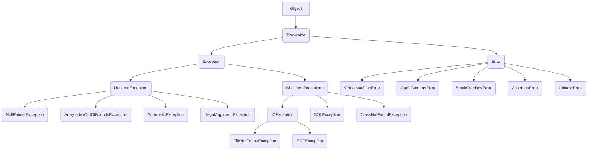

# Exception Handling

## What is an Exception ?
> In Java, an exception is an event occurs during the execution of program, disrupting its normal flow.
> When that happens the program will be terminated abruptly if not handled properly using Java's ``Exception Handling`` techniques.

## What is an Exception Handling ?
> - Exception Handling in Java is an effective mechanism for managing runtime & compile time errors to ensure the application's regular flow is maintained.
> - By handling exceptions, Java enables developers to create robust and fault-tolerant applications.

## Why do we need an Exception Handling ?


```java
     Class ExceptionDemo {
            public static void main(String[] args) {
                int n = 10;
                int m = 0;
                
                int ans = n / m;
                // This line never gets executed as on the above line an exception has occurred.
                System.out.println("Result after divide by zero: " + ans);
            }
        }
        /**
         *    This throws ArithmeticException
        **/
```


```java
class ExceptionDemoByHandlingException {
    public static void main(String[] args) {
        int n = 10;
        int m = 0;
        
        try {
            // At below line, the exception occurs.
            int ans = n / m;
            // This never gets executed as the control goes to `catch` block to handle the exception
            System.out.println("Result after divide by zero: " + ans);
        } catch (ArithmeticException arithmeticException) {
            /*
                    Exception is handled here.
             */
            System.out.println("A number cannot be divided by zero. " +
                    "Exception occurred. Reason :" + arithmeticException);
        } finally {
            /*
                    finally block gets executed under any circumstances.
             */
            System.out.println("Program is continuing after handling the exception");
        }
    }
}
```


## Exception Hierarchy 

