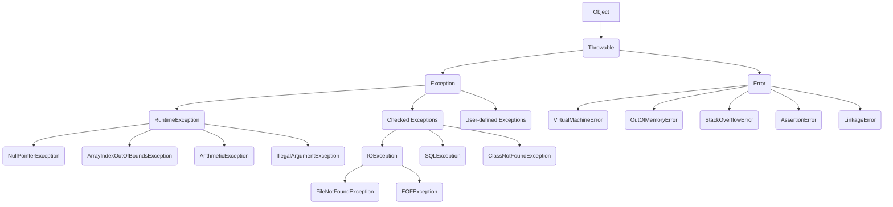
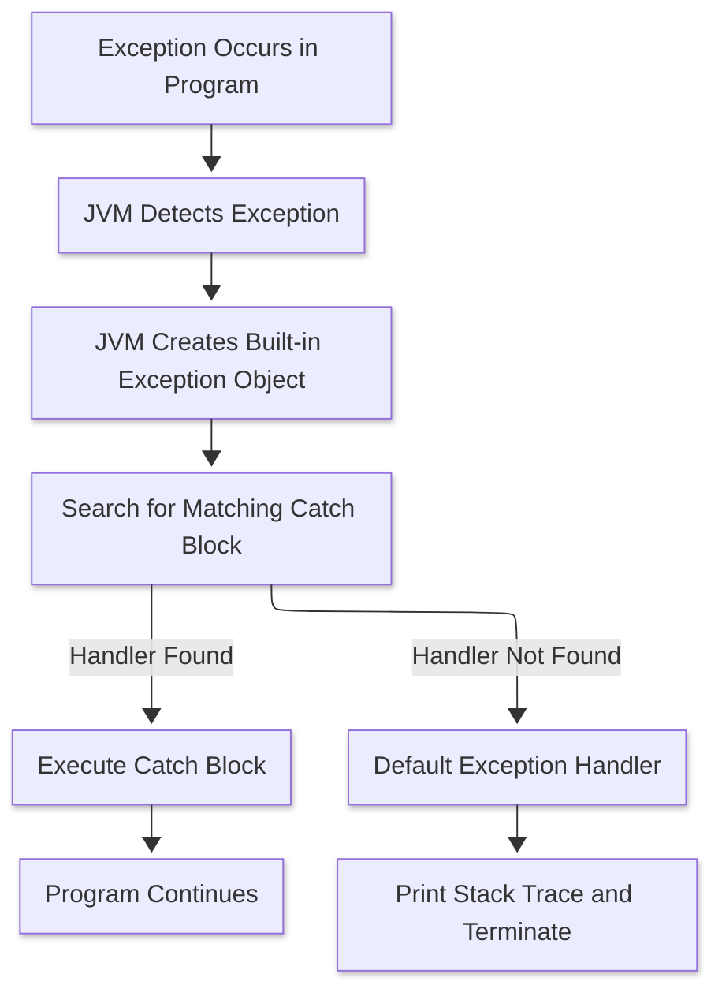

# Exception Handling

## What is an Exception ?
> In Java, an exception is an event occurs during the execution of program, disrupting its normal flow.
> When that happens the program will be terminated abruptly if not handled properly using Java's ``Exception Handling`` techniques.

### Reasons -
#### Programming errors (Unchecked exceptions)
1. [x] Invalid array access : Attempting to access an array element using an index outside the array's bounds. This leads to `ArrayIndexOutOfBoundsException`.
2. [x] Null reference access : Trying to access a method or field of an object whose reference is null. This causes a `NullPointerException`.
3. [x] Division by zero : Performing a division operation where the divisor is zero, resulting in an `ArithmeticException`.
4. [x] Invalid arguments to a method: Passing inappropriate or out-of-range values to a method, triggering an `IllegalArgumentException`.
5. [x] Type mismatch or illegal casts: Trying to cast an object to a class it's incompatible with, resulting in a `ClassCastException`.
6. [x] Class not found: Attempting to load a class that doesn't exist or is not available on the classpath, leading to `ClassNotFoundException`.
7. [x] Missing or non-existent methods/fields: Using reflection or class loading to access a method or field that is unavailable or non-existent in the target class, resulting in `NoSuchMethodException` or `NoSuchFieldException`.
8. [x] Incorrect API usage: Using an API incorrectly can cause various exceptions, depending on the API and the type of incorrect usage.

### Resource-related issues (Checked Exceptions)
1. [x] File Handling problems : Issues like trying to open a file that doesn't exist, reading past the end of a file, or insufficient permissions for file operations can cause IOException or its subclasses, such as `FileNotFoundException`.
2. [x] Network Connectivity Issues: Loss of network connection, server downtime, or firewall restrictions during network operations can trigger exceptions like `IOException` or `SocketException`.

## What is an Exception Handling ?
> - Exception Handling in Java is an effective mechanism for managing runtime & compile time errors to ensure the application's regular flow is maintained.
> - By handling exceptions, Java enables developers to create robust and fault-tolerant applications.

## Why do we need an Exception Handling ?


```java
     Class ExceptionDemo {
            public static void main(String[] args) {
                int n = 10;
                int m = 0;
                
                int ans = n / m;
                // This line never gets executed as on the above line an exception has occurred.
                System.out.println("Result after divide by zero: " + ans);
            }
        }
        /**
         *    This throws ArithmeticException
        **/
```


```java
class ExceptionDemoByHandlingException {
    public static void main(String[] args) {
        int n = 10;
        int m = 0;
        
        try {
            // At below line, the exception occurs.
            int ans = n / m;
            // This never gets executed as the control goes to `catch` block to handle the exception
            System.out.println("Result after divide by zero: " + ans);
        } catch (ArithmeticException arithmeticException) {
            /*
                    Exception is handled here.
             */
            System.out.println("A number cannot be divided by zero. " +
                    "Exception occurred. Reason :" + arithmeticException);
        } finally {
            /*
                    finally block gets executed under any circumstances.
             */
            System.out.println("Program is continuing after handling the exception");
        }
    }
}
```


## Exception Hierarchy 


### Explanation -
- `Object` - The base class for all Java classes including exceptions & errors.
- `Throwable` - The root for the exception hierarchy and a direct subclass of `Object`. Any object representing an error or exceptional event must be a subclass of `Throwable`.
- `Exception` can be further categorized into 2 parts.
    - Checked Exception / Compile Time Exception
    - Unchecked Exception / `RuntimeException`
- `Error` - Represents severe problems, usually related to the `Java Virtual Machine (JVM)` or system resources, that are typically irrecoverable. Errors are not meant to be caught or handled
  by applications.

## How does JVM (Java Virtual Machine) handles an Exception ?

