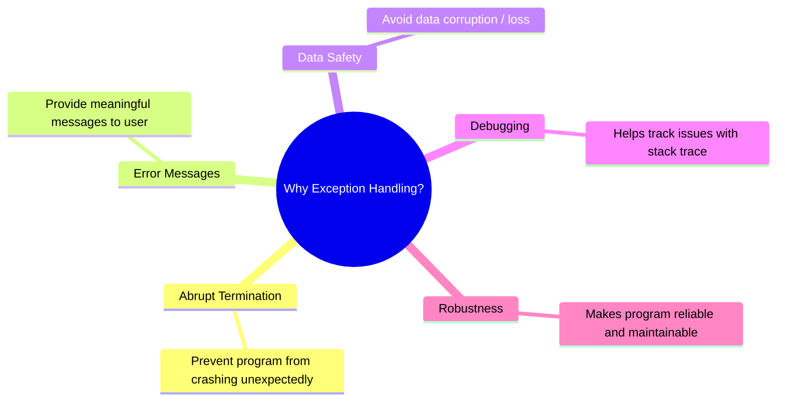
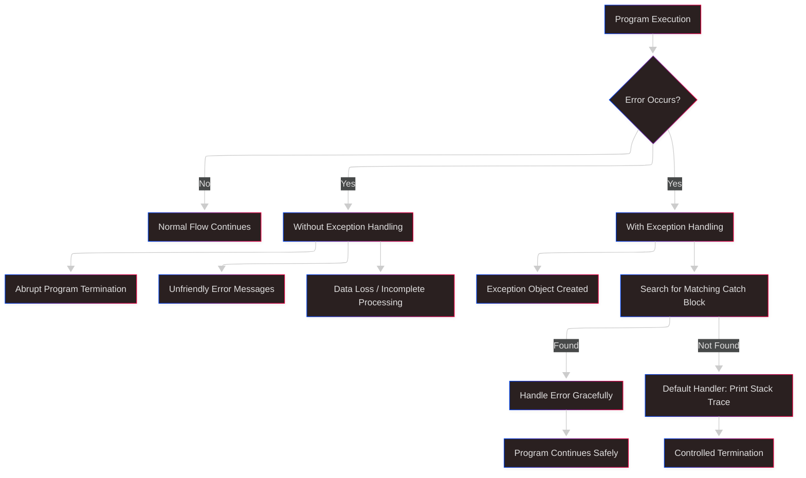
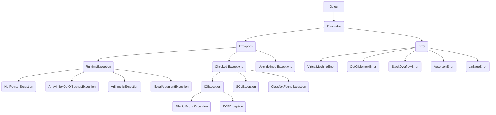
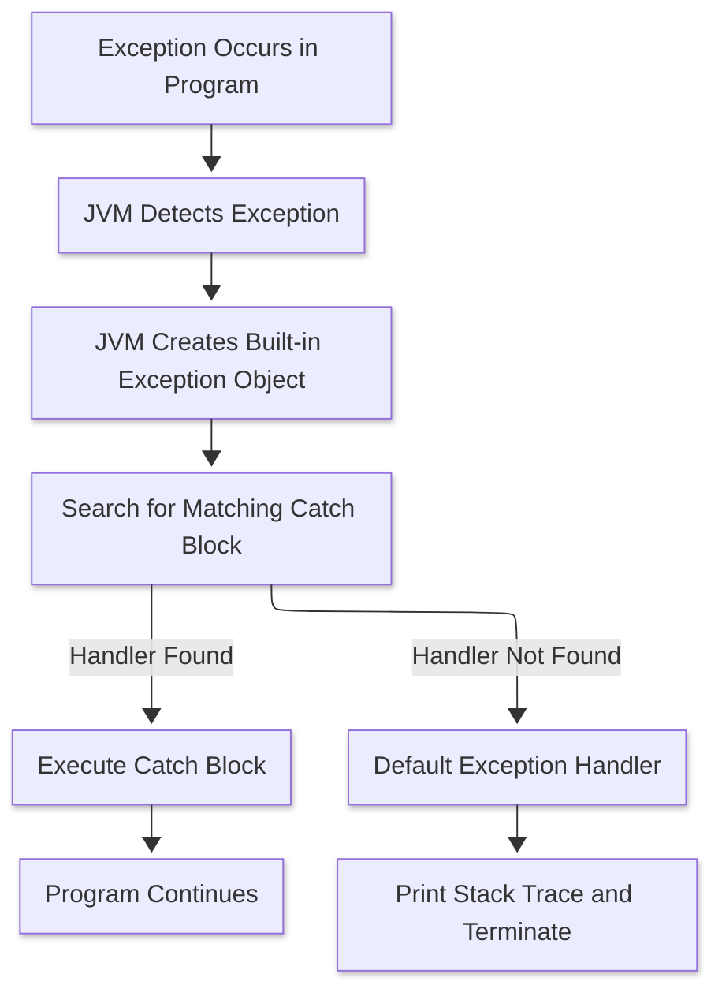
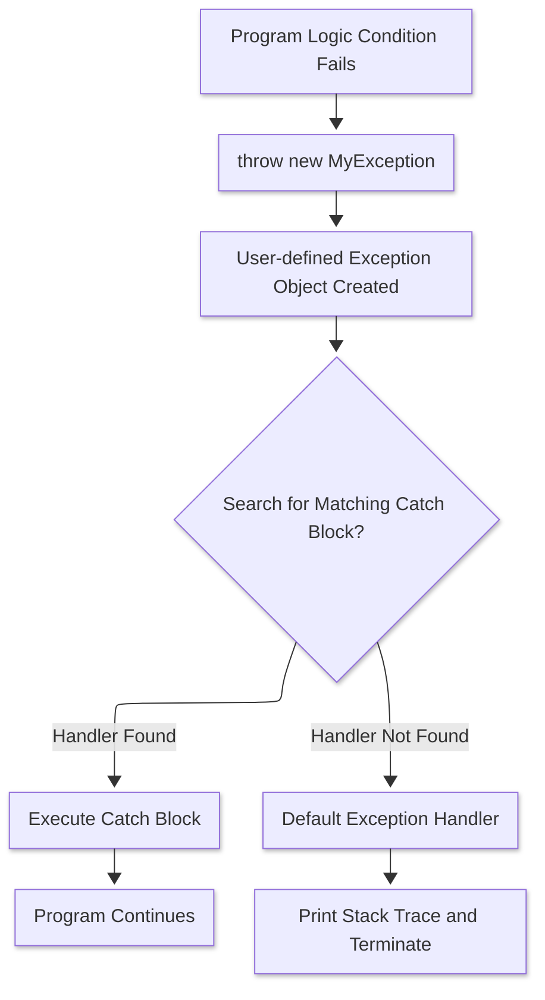
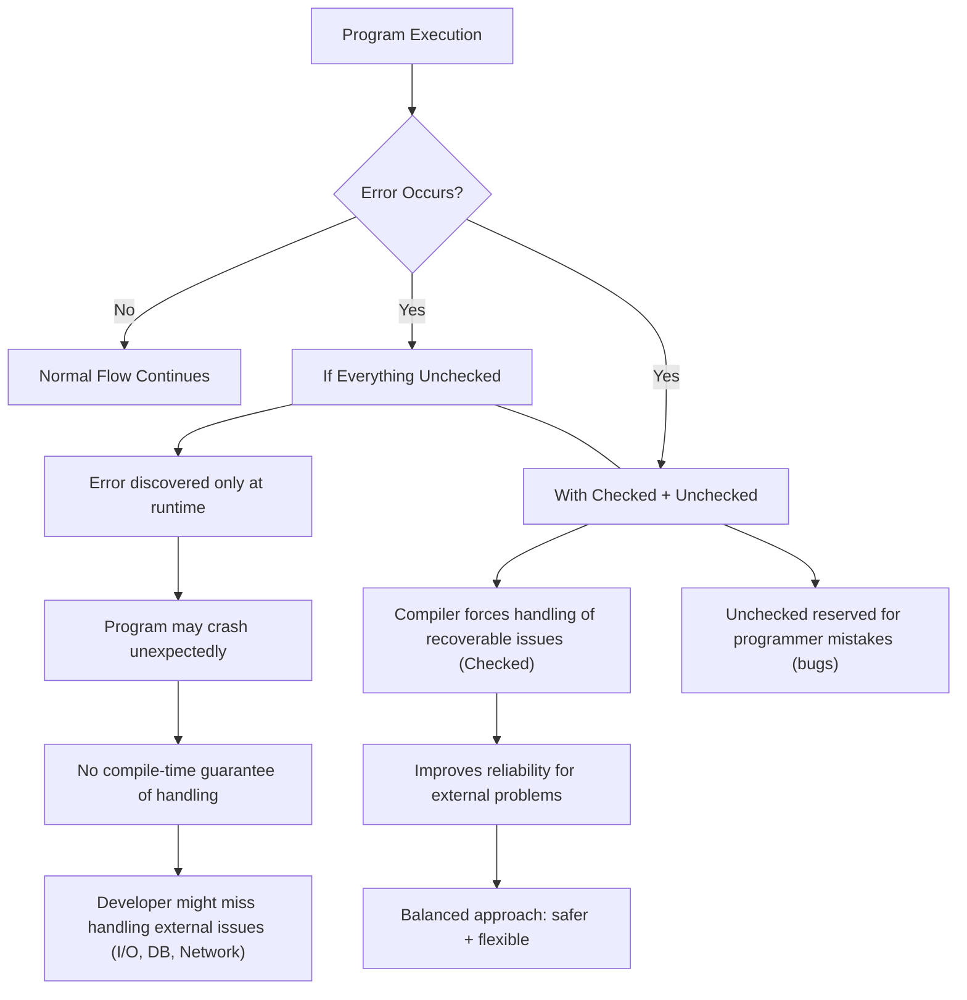
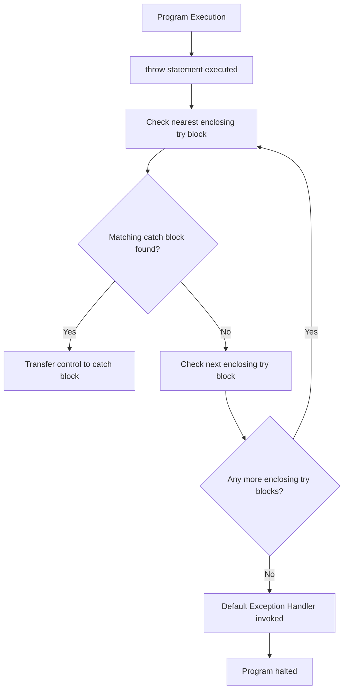
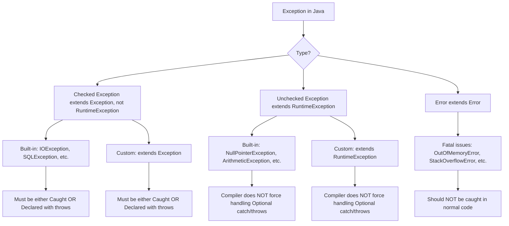
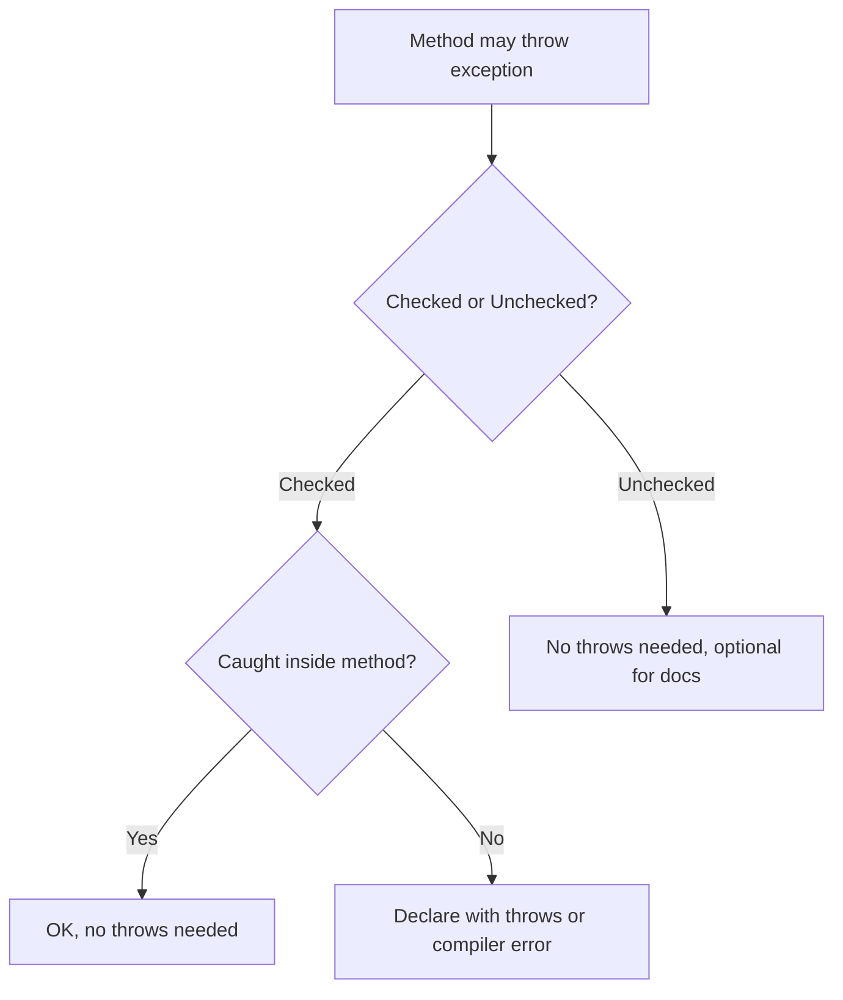

# Exception Handling

## What is an Exception ?
> In Java, an exception is an event occurs during the execution of program, disrupting its normal flow.
> When that happens the program will be terminated abruptly if not handled properly using Java's ``Exception Handling`` techniques.

### Reasons -
#### Programming errors (Unchecked exceptions)
1. [x] Invalid array access : Attempting to access an array element using an index outside the array's bounds. This leads to `ArrayIndexOutOfBoundsException`.
2. [x] Null reference access : Trying to access a method or field of an object whose reference is null. This causes a `NullPointerException`.
3. [x] Division by zero : Performing a division operation where the divisor is zero, resulting in an `ArithmeticException`.
4. [x] Invalid arguments to a method: Passing inappropriate or out-of-range values to a method, triggering an `IllegalArgumentException`.
5. [x] Type mismatch or illegal casts: Trying to cast an object to a class it's incompatible with, resulting in a `ClassCastException`.
6. [x] Class not found: Attempting to load a class that doesn't exist or is not available on the classpath, leading to `ClassNotFoundException`.
7. [x] Missing or non-existent methods/fields: Using reflection or class loading to access a method or field that is unavailable or non-existent in the target class, resulting in `NoSuchMethodException` or `NoSuchFieldException`.
8. [x] Incorrect API usage: Using an API incorrectly can cause various exceptions, depending on the API and the type of incorrect usage.

### Resource-related issues (Checked Exceptions)
1. [x] File Handling problems : Issues like trying to open a file that doesn't exist, reading past the end of a file, or insufficient permissions for file operations can cause IOException or its subclasses, such as `FileNotFoundException`.
2. [x] Network Connectivity Issues: Loss of network connection, server downtime, or firewall restrictions during network operations can trigger exceptions like `IOException` or `SocketException`.

## What is an Exception Handling ?
> - Exception Handling in Java is an effective mechanism for managing runtime & compile time errors to ensure the application's regular flow is maintained.
> - By handling exceptions, Java enables developers to create robust and fault-tolerant applications.

## Why do we need an Exception Handling ?


## Advantages of Exception Handling ?


## Difference between `Exception` & `Error`
| Aspect                | Exception                                                                 | Error                                                                 |
|------------------------|---------------------------------------------------------------------------|----------------------------------------------------------------------|
| Definition             | Represents conditions that a program can anticipate and handle gracefully | Represents serious issues that occur at runtime, mostly beyond the control of the program |
| Recoverability         | Usually recoverable with proper handling                                  | Generally not recoverable                                            |
| Handling Mechanism     | Can be caught and handled using `try-catch` blocks                        | Not recommended to catch; often leads to unstable program state      |
| Examples               | `IOException`, `SQLException`, `NullPointerException`, `ClassNotFoundException` | `OutOfMemoryError`, `StackOverflowError`, `VirtualMachineError`      |
| Origin                 | Mostly due to programming mistakes or external resource failures          | Mostly due to JVM limitations, hardware failure, or system crash     |
| Program Continuation   | Program can often continue after handling the exception                   | Program usually terminates abnormally                                |
| Part of                | `java.lang.Exception` class                                               | `java.lang.Error` class                                              |

```java
class ExceptionDemo {
    public static void main(String[] args) {
        int n = 10;
        int m = 0;
                
                int ans = n / m;
                // This line never gets executed as on the above line an exception has occurred.
                System.out.println("Result after divide by zero: " + ans);
    }
}
/**
 *    This throws ArithmeticException
 **/
```


```java
class ExceptionDemoByHandlingException {
    public static void main(String[] args) {
        int n = 10;
        int m = 0;
        
        try {
            // At below line, the exception occurs.
            int ans = n / m;
            // This never gets executed as the control goes to `catch` block to handle the exception
            System.out.println("Result after divide by zero: " + ans);
        } catch (ArithmeticException arithmeticException) {
            /*
                    Exception is handled here.
             */
            System.out.println("A number cannot be divided by zero. " +
                    "Exception occurred. Reason :" + arithmeticException);
        } finally {
            /*
                    finally block gets executed under any circumstances.
             */
            System.out.println("Program is continuing after handling the exception");
        }
    }
}
```


## Exception Hierarchy 


### Explanation -
- `Object` - The base class for all Java classes including exceptions & errors.
- `Throwable` - The root for the exception hierarchy and a direct subclass of `Object`. Any object representing an error or exceptional event must be a subclass of `Throwable`.
- `Exception` can be further categorized into 2 parts.
    - Checked Exception / Compile Time Exception
    - Unchecked Exception / `RuntimeException`
- `Error` - Represents severe problems, usually related to the `Java Virtual Machine (JVM)` or system resources, that are typically irrecoverable. Errors are not meant to be caught or handled
  by applications.

## How does JVM (Java Virtual Machine) handles an Exception ?

### Built-in Exception -


### User-defined Exception -

1. When an exception occurs, the JVM creates an `Exception` object (subclass of Throwable) containing the error name, description and program state.<br>
   - Error type / name : `NullPointerException` <br>
   - Description / Message : String passed to constructor or default one <br>
   - Program state / stack trace : Method calls, line numbers etc
2. Creating the exception object and handling it in the run-time system is called throwing an exception. <br>
   - Throwing = Creating an exception + handling it over to JVM's runtime system.
   - Example : `throw new ArithmeticException("/ by zero");` --> In case of built-in exception by itself as JVM knows about the exception. You don't have to do anything. <br>
               `throw new MyException("This is a custom exception");` --> you throw it to JVM.
3. There might be a list of the methods that had been called to get to the method where an exception occurred. This ordered list of methods is called `call stack`.
   - call stack = chain of method calls.
   - Example : `main() |- methodA() |- methodB() |- methodC() ` (Exception in methodC())
   - JVM stores this in the stack trace.
4. The run-time system searches the call stack for an exception handler
   - JVM uses the exception table (built at compile time from `try/catch`) to know where the handlers are.
5. It starts searching from the method where the exception occurred and proceeds backward through the call stack.
   - This is called `stack unwinding`
   - JVM first looks in the current method; if not found, pops method, goes to caller, repeats.
6. If a handler is found, the exception is passed to it.
   - If a matching `catch` is found, JVM transfers control there.
7. If no handler is found, the default exception handler terminates the program and prints the stack trace.
   - Default Handler = part of JVM runtime
   - Behaviour : `Print stack trace -> Terminate thread/program`
   - In main thread: JVM ends program. In other threads: that thread dies, rest continue
      
## Important points to note :

##### **POINT - 1**
- When JVM handles built-in exceptions :
  - If your code causes something like 10/0 -> JVM automatically creates an `ArithmeticException` object.
  - You don't explicitly create or throw it -> JVM does it for you.
- When you use a custom or user-defined exception
  - You must explicitly create and throw the object - JVM will not do it for you.
  - JVM won't automatically throw your custom class, because it does not know your conditions.
- What if you don't use `throw` for user-defined exceptions
  - If you just write a try-catch block with your custom exception class but never throw it, it will never be triggered. 
  - The catch block will remain unused. 
  - So for user-defined exceptions, you either:
    - Explicitly throw them where needed, OR
    - Use them in method signatures (throws MyException) and throw them later.

##### **POINT - 2**
- when you are using a custom OR user-defined exception
   - Define a user-defined exception class by extending `Exception` class
   - Either inside the same function, you both `throw` and `catch` that exception. OR `throw` at the lower-level method and `catch` it in a higher-level i.e. called of the method.
   ```java
   class MyException extends Exception {
        public MyException(String message) {
            super(message);
        }
   }
  
   public class Test {
        public static void main(String[] args) {
            new Test().process();
        }
        void process() {
            try {
                // Some condition fails
                if (true) {
                    throw new MyException("Custom check failed!");
                }
                System.out.println("Normal execution...");
             } catch (MyException e) {
                System.out.println("caught inside same method: " + e.getMessage());
             }
             System.out.println("After catch block, program continues...");
        }
  }
  ```
- What if you don't write the `catch` at all
   - JVM creates your custom Exception class object and starts searching for a matching catch in the same method.
      - If no catch exists in that method.
         - The JVM looks at the caller method in the call stack.
         - If the caller also does not handle it, the exception keeps bubbling up the stack.
      - if no method in the stack handles it:
         - The JVM finally hands it over to the default exception handler.
         - The default handler:
            - prints the stack trace (Showing error name, message, and call chain)
            - terminates the program
   - For `Checked Exceptions` (like your MyException if it extends `Exception`), then compiler forces you to either:
        - Handle with try-catch, or
        - Declare with `throws` keyword in the method signature
   - For `Unchecked Exceptions` (If your MyException extends `RuntimeException`), you don't need `throws`, but the bubbling and default handler behaviour is the same.
  
   ```java
   class MyException extends Exception {
        public MyException(String message) {
            super(message);
        }
   }
   class Test {
        public static void main(String[] args) {
            new Test().process();
            System.out.println("This line will NOT execute if exception is not caught");
        }
        void process() throws MyException { // throws because MyException is considered to be a Checked Exception
            // No try-catch here
            throw new MyException("Something went wrong");
        }
   }
  ```
  

## Checked vs UnChecked Exceptions :
- **Checked Exceptions** : These exceptions are checked at compile time, forcing the programmer to handle them explicitly.
- **Unchecked Exceptions** : These exceptions are checked at runtime and do not require handling at compile time. 

### Checked Exceptions 
- These are the exceptions that are checked at compile time.
- If a method throws checked exception, then the exception must be handled using a `try-catch` block and declared the exception in the method signature
  using the `throws` keyword.
- Checked exceptions represent invalid conditions in areas outside the immediate control of the program like memory, network, file system etc.
- Any checked exception is a subclass of `Exception`.
- Unlike Unchecked exceptions, checked exceptions must be either caught by the caller or listed as part of the method signature using the `throws` keyword.
- Checked exceptions can be categorized into 2 parts.
    - `Fully Checked Exception` - A checked exception where all of its child classes are also checked. (E.g. `IOException`, `InterruptedException`)
    - `Partially Checked Exception` - A checked exception where some of its child classes are unchecked. (E.g. `Exception`)

### Unchecked Exceptions
- These are the exceptions that are not checked at compile time.
- In Java, exception classes under `Error` & `RuntimeException` classes are unchecked exceptions, everything else under `Throwable` is checked.
- These are runtime exceptions that are not required to be caught or declared in a `throws` clause.
- These exceptions are caused by programming errors, such as attempting to access index out of bounds in an array or attempting to divide by zero.


## Important points to note :
### POINT - 1
### Why JAVA introduced `Checked Exceptions` ? Why cannot everything be put inside `Unchecked Exceptions` ?

- Forcing developers to handle critical failures (Checked Exceptions)
   - Some failures cannot be ignored safely (e.g., IOException, SQLException).
   - If everything were runtime exceptions, a careless developer might just skip handling them → leading to data loss, corrupted files, or security issues.
   - By making them checked, Java forces you to acknowledge and handle them either by:
       - Catching with try-catch, OR
       - Declaring with throws in method signature.

```java
import java.io.FileReader;

FileReader fr = new FileReader("abc.txt"); // FileNotFoundException must be handled
```
- Separating developer errors vs external failures
  - Unchecked exceptions (Runtime) → represent programming mistakes that are not expected to be recovered from.
      - Examples: `NullPointerException`, `ArrayIndexOutOfBoundsException`, `IllegalArgumentException`.
      - They indicate bugs in the code logic → should be fixed in development, not handled at runtime.
  - Checked exceptions → represent external problems (files, DB, network, resources) that the program can anticipate and recover from.
- Encouraging robust & reliable programs
  - Checked exceptions were meant to make enterprise applications safer.
  - Especially in the 90's, when Java was designed for large-scale business apps, robust error handling was critical.
- Why not make everything runtime ?
  - If everything were unchecked:
      - Developers might forget to handle critical issues (file not found, DB connection failure)
      - Code would compile fine, but would blow up at runtime unexpectedly.
      - larger systems would become unreliable.

### Code analysis -
1. **Checked Exception (Compile-time) example**
```java
import java.io.BufferedReader;
import java.io.FileReader;
import java.io.IOException;

public class CheckedExample {
    public static void main(String[] args) {
        try {
            // Trying to open a file that may or may not exist
            FileReader f = new FileReader("abc.txt");
            BufferedReader b = new BufferedReader(f);
            System.out.println(b.readLine());
        } catch (IOException e) {
            System.out.println("Error: " + e.getMessage());
        }
    }
}
```
- `FileReader` constructor can throw `FileNotFoundException` (a checked exception).
- The compiler forces you to wrap in `try-catch` or declare `throws IOException` in the method.
- Why ? Because missing files, permission issues, disk errors --> are external problems you must plan for.

2. **Unchecked Exception (Runtime) example**
```java
public class UncheckedExample {
    public static void main(String[] args) {
        int[] arr = {10, 20, 30};
        
        // Accessing out of bounds index
        System.out.println(arr[5]);  // Runtime error: ArrayIndexOutOfBoundsException
    }
}
```
- This is a programmer mistake (bad index)
- Compiler does not ask you to handle it, because the right solution is to fix the bug -> not to surround every array access with `try-catch` block.

3. **What if all were `Runtime` exceptions ?**
```java
import java.io.*;

public class AllUncheckedExample {
    public static void main(String[] args) throws Exception {
        // If IOException was unchecked, compiler wouldn't complain
        FileReader fr = new FileReader("abc.txt");
        BufferedReader br = new BufferedReader(fr);
        System.out.println(br.readLine());
    }
}
```
📌 Problem:
- Program compiles fine even if we don't handle missing file.
- At runtime -> if file is absent -> app crashes unexpectedly.
- In a banking or medical system, this would be dangerous.
That's why Java designers made I/O, DB, network etc. Checked exceptions -> You must consciously handle them.


## `final` VS `finally` VS `finalize()`
- `final` enforces immutability and prevents changes to variables, methods & classes.
- `finally` ensures a block of code runs after a `try-catch` regardless of exceptions.
- `finalize` is a method used for cleanup before an object is garbage collected.

###  `final` -
- This keyword is used with variables, methods & with classes to restrict modification.
```java
class FinalDemo {
    public static void main(String[] args) {
        // Non final variable
        int a = 10;
        
        // final variable
        final int b = 6;
        
        // Modify the non-final variable
        a++;
        // Modify the final variable
        b++;
    }
}
/**
 *   O/P -
 *   Java: Cannot assign a value to final variable 
 */
```
- Declaring a variable as `final` means, we are not allowed to modify its value. Attempting to do so will result `Compilation error`
- Similarly, `final` with methods & classes does impose certain more restrictions.

### `finally`
- It is used to create a block of code that always gets executed after the `try` block, regardless whether an exception occurs or not.
```java
class ExceptionDemoByHandlingException {
    public static void main(String[] args) {
        int n = 10;
        int m = 0;

        try {
            // At below line, the exception occurs.
            int ans = n / m;
            // This never gets executed as the control goes to `catch` block to handle the exception
            System.out.println("Result after divide by zero: " + ans);
        } catch (ArithmeticException arithmeticException) {
            /*
                    Exception is handled here.
             */
            System.out.println("A number cannot be divided by zero. " +
                    "Exception occurred. Reason :" + arithmeticException);
        } finally {
            /*
                    finally block gets executed under any circumstances.
             */
            System.out.println("Program is continuing after handling the exception");
        }
    }
}
```

### `finalize()`
- It is called by the garbage collector just before an object is removed from memory.
- It allows use to perform cleanup activity.
- Once the `finalize()` completes, Garbage collector destroys that object.
- `finalize()` is present in `Object` class

## `finalize()` is deprecated from Java 9 and should not be used in modern applications. It is recommended to use `try-with-resources` or other clean-up mechanisms instead of relying on `finalize()`

```java
public class FinalizeDemo {
    public static void main(String[] args) {
        FinalizeDemo demo = new FinalizeDemo();
        System.out.println("Hashcode is: " + demo.hashCode());
        // Making the object eligible for garbage collection
        demo = null;
        System.gc();
        // Adding a short delay to allow Garbage Collector to act
        try {
            Thread.sleep(5000);
        } catch (InterruptedException e) {
            e.printStackTrace();
        }
        System.out.println("End of Garbage Collection");
    }
    
    // Defining the finalize()
    @Override protected void finalize() {
        System.out.println("Called the finalize() method");
    }
}
/**
 *  O/P -
 *   Hashcode is: 1480010240
 *   Called the finalize() method
 *   End of Garbage Collection
 */
```
- In the above example, an object `demo` is created and its hashcode is printed. The object is made available for garbage collection by setting it to `NULL` and invoking `System.gc()`


## `throw` & `throws`

### `throw`
- The `throw` keyword in Java is used to explicitly throw an exception from a method or any block of code.
- Both `Checked` & `Unchecked` exception can be thrown.
- syntax `throw instance` e.g. `throw new ArithmeticException("/by zero");`
- The throw instance must be an object of `Throwable` or its subclass i.e. `Exception`
#### Example - 1
```shell
public void divide(int a, int b) {
    if (b == 0) {
        throw new ArithmeticException("Division by zero is not allowed");
    }
    System.out.println(a / b);
}
```
#### Example - 2
```shell
public void readFile(String path) throws IOException {
    FileReader reader = new FileReader(path); // IOException may occur
    // ...
}
```


#### Example - 1
## Matching `catch` block found
```java
public class ThrowDemo1 {
    public static void main(String[] args) {
        try {
            System.out.println("Inside try block...");
            throw new IllegalArgumentException("Invalid input!"); // execution stops here
        } catch (IllegalArgumentException e) {
            System.out.println("Caught exception: " + e.getMessage());
        }

        System.out.println("Program continues normally after handling exception.");
    }
}
/**
 *   Output -
 *   Inside try block
 *   Caught exception : Invalid input
 *   Program continues normally after handling exception
 */
```
✅ Here, the thrown exception is caught immediately by the matching `catch` block. So the program continues.

#### Example - 2
## Checked at outer `try`
```java
public class ThrowDemo2 {
    public static void main(String[] args) {
        try {
            try {
                System.out.println("Inner try...");
                throw new NullPointerException("Something went wrong!");
            } catch (IllegalArgumentException e) {
                System.out.println("Caught IllegalArgumentException");
            }
        } catch (NullPointerException e) {
            System.out.println("Caught in outer catch: " + e);
        }
    }
}
/**
 *   Inner try...
 *   Caught in outer catch: java.lang.NullPointerException: Something went wrong!
 */
```
✅ Since the `inner catch` does not match, the exception bubbles up and is caught by the `outer catch`

#### Example - 3
## No matching `catch` -> Default handler halts program
```java
public class ThrowDemo3 {
    public static void main(String[] args) {
        try {
            System.out.println("About to throw...");
            throw new ArrayIndexOutOfBoundsException("Index issue!");
        } catch (IllegalArgumentException e) {
            System.out.println("Caught IllegalArgumentException");
        }

        // This line will never execute because no catch matched
        System.out.println("End of program.");
    }
}
/**
 * About to throw...
 * Exception in thread "main" java.lang.ArrayIndexOutOfBoundsException: Index issue!
 * at ThrowDemo3.main(ThrowDemo3.java:5)
 */
```
❌ No catch matched → the default exception handler prints stack trace and halts program.


## Note -
## Point 1

✅ Explanation -
- If it's a Checked Exception (`extends Exception`) => Java Compiler forces you to `either catch or declare with throws keyword.`
- If it's an Unchecked Exception (`extends RuntimeException`) => Compiler does not care; you may handle, but it's optional.
- If it's an error => you normally don't handle (JVM level fatal issue)

Case 1 -
#### Checked Custom Exception 
- If your custom exception extends Exception (but not RuntimeException), it becomes a checked exception. <br>
➡️ Rule:
    - You must either catch it or declare it using `throws`
    - If you don't catch it or throws, compilation error occurs
```java
// Custom checked exception
class MyCheckedException extends Exception {
    public MyCheckedException(String message) {
        super(message);
    }
}

public class Demo {
    public static void main(String[] args) {
        try {
            doWork();
        } catch (MyCheckedException e) {   // ✅ must catch
            System.out.println("Handled: " + e.getMessage());
        }
    }

    static void doWork() throws MyCheckedException {  // ✅ or declare throws
        throw new MyCheckedException("Something bad happened");
    }
}
```

Case 2 -
#### Unchecked Custom Exception
- If your custom exception `extends RuntimeException`, it is `unchecked`.<br>
➡️ Rule:
    - You don't need to catch or declare with throws. (though you can if you want)
    - Program compiles fine without catch or throws.
    - If exception actually happens, JVM will throw it at runtime and may terminate program unless caught.
```java
// Custom unchecked exception
class MyUncheckedException extends RuntimeException {
    public MyUncheckedException(String message) {
        super(message);
    }
}

public class Demo {
    public static void main(String[] args) {
        doWork();  // ❌ no need to catch or declare
    }

    static void doWork() {
        throw new MyUncheckedException("Runtime failure");
    }
}
```

## Point 2
```java
public class ThrowDemo2 {
    public static void main(String[] args) {
        try {
            try {
                System.out.println("Inner try...");
                int x = 10 / 0; // This throws ArithmeticException
            } catch (IllegalArgumentException e) {
                System.out.println("Caught IllegalArgumentException");
            }
        } catch (NullPointerException e) {
            System.out.println("Caught in outer catch: " + e);
        }
    }
}
/**
 *  O/P -
 *  Inner try...
 *  Exception in thread "main" java.lang.ArithmeticException: / by zero
 *  at ThrowDemo2.main(ThrowDemo2.java:7)
 */
```
Let's say in the above program, we have not thrown any exception (whether checked or unchecked) by ourselves. But, `int x = 10 / 0;` will eventually cause 
`ArithmeticException` and it is a `RuntimeException`.
So, here how its gets executed.
1. Execution enters inner try and throws `ArithmeticException`.
2. The inner catch block only handles `IllegalArgumentException`.
   - But the thrown exception is `ArithmetciException`.
   - So, the inner catch does not match -> exception remains unhandled inside inner try.
3. The exception `bubbles up` (propagates) to the outer try-catch.
   - Outer catch is only for `NullPointerException`
   - But the thrown exception is `ArithmeticException`
   - No match found again.
4. Since no catch matches at any level, the exception is passed to the default exception handler.
5. Default Handler:
   - Prints the stack trace of the `ArithmeticException`.
   - program terminates abnormally.


### `throws`

#### What is `throws` ?
- It is a `method/ constructor` level declaration keyword.
- It tells the compiler and caller that this method might pass an execution up instead of handling it.
- It is part of the method signature.

> 👉 Think of it as a warning label: <br>
> "Hey caller", I might throw this kind of checked exception - handle it if you want to use me."


#### What does `throws` do ?
- It declares exceptions that can propagate out of the method.
- It does not throw exceptions (that's `throw` keyword job)
- It allows the caller to decide whether to handle the exception or further propagate it.

#### When `throws` keyword is required ?
- Required only for Checked Exceptions (Subclass of `Exception` excluding `RuntimeException`)
- Unchecked Exceptions (RuntimeException & Error) don't require `throws`, though you can declare them for documentation.

1. Checked Exceptions -> must use `throws` or `try-catch`
```java
import java.io.*;

class FileReaderDemo {
    // Declares: may throw IOException
    static String readFile(String path) throws IOException {
        BufferedReader br = new BufferedReader(new FileReader(path));
        return br.readLine();
    }

    public static void main(String[] args) {
        try {
            System.out.println(readFile("data.txt"));
        } catch (IOException e) { // must handle
            System.out.println("File problem: " + e.getMessage());
        }
    }
}
```
✅ Without throws IOException here, it won’t compile because FileReader constructor can throw IOException.

2. Unchecked Exception -> `throws` not required
```java
class DivideDemo {
    static int divide(int a, int b) {
        return a / b; // may throw ArithmeticException (unchecked)
    }

    public static void main(String[] args) {
        System.out.println(divide(10, 0)); // Runtime crash, no compiler error
    }
}
```
✅ No need for throws ArithmeticException, compiler doesn’t force it.

3. Propagation with `throws`
```java
import java.sql.*;

class Dao {
    String getData() throws SQLException {
        throw new SQLException("DB not available");
    }
}

class Service {
    String fetch() throws SQLException { // propagates
        return new Dao().getData();
    }
}

public class App {
    public static void main(String[] args) {
        try {
            System.out.println(new Service().fetch());
        } catch (SQLException e) {
            System.out.println("Handled at top: " + e.getMessage());
        }
    }
}
```
✅ Exception “bubbles up” until handled.

4. Constructor with `throws`
```java
import java.io.*;

class Resource {
    Resource() throws IOException {
        throw new IOException("Failed init");
    }
}

public class Demo {
    public static void main(String[] args) {
        try {
            new Resource(); // must catch or declare
        } catch (IOException e) {
            System.out.println("Handled constructor error: " + e.getMessage());
        }
    }
}
```
| Case               | `throws` Required? | Example                        |
|--------------------|---------------------|--------------------------------|
| **Checked Exception** (e.g., `IOException`) | ✅ Yes | `new FileReader("file.txt")` |
| **Unchecked Exception** (e.g., `NullPointerException`) | ❌ No  | `int x = 5 / 0;` |
| **Catching Locally** (handled inside method) | ❌ No  | try–catch inside same method |
| **Propagate Further** (pass to caller) | ✅ Yes (for checked exceptions) | declaring `throws IOException` |




## `throws` is Java’s way of forcing you to acknowledge and deal with checked exceptions.

### Notes -
1. #### Can we write `throws` without `throw` ? <br>
   👉 YES, you can write `throws` without actually using `throw` in the method body.
   - The compiler only checks whether the method declares exceptions. (for checked ones)
   - It does not force you to actually throw them inside the method.
```java
import java.io.IOException;

class Demo {
    // Declares but doesn't throw anything
    static void test() throws IOException {
        System.out.println("Hello, I declared IOException but didn't throw it!");
    }

    public static void main(String[] args) {
        try {
            test();
        } catch (IOException e) {
            System.out.println("Caught: " + e.getMessage());
        }
    }
}
```
✅ This compiles and runs fine. <br>
⚠️ But declaring unnecessary exceptions is bad practice, because it misleads callers into thinking they need to handle something that will never happen.

2. #### Can we write `throw` without `throws` ?
```java
class Demo2 {
    static void test() {
        throw new ArithmeticException("Boom!"); // unchecked
    }

    public static void main(String[] args) {
        test(); // No try-catch, no throws needed
    }
}
```
✅ Allowed because unchecked exceptions don’t need throws.

#### 🔑 Rule of Thumb
- `throws` can exist without `throw` (Legal, but misleading)
- `throw` can exist without `throws` if it's an unchecked exception.
- If you throw a checked exception, then throws (or catch) is mandatory.

### 👉 throws is only a declaration (compiler-level), while throw is the action (runtime-level).

3. If a method `throws` an exception (Checked or Unchecked), then is it mandatory for caller of that method to handle with `throws` or `try-catch` block. <br>
   Also, if the method `throw` an exception & handle with `try-catch` within the same function. Then does the caller need to `throws` that exception ?

#### 1️⃣ If the method throws a Checked Exception
- The caller must either :
   - Handle it with `try-catch`, OR
   - Declare it again with `throws`
- Because the compiler forces handling of checked exceptions.

✅ Example (Checked Exception – must handle or declare):
```java
import java.io.IOException;

class Demo {
    static void risky() throws IOException {
        throw new IOException("Disk error!");
    }

    public static void main(String[] args) {
        try {
            risky(); // Must handle because risky() declares IOException
        } catch (IOException e) {
            System.out.println("Handled: " + e.getMessage());
        }
    }
}
```
👉 If you remove the try-catch, compiler will force you to add throws IOException in main.

#### 2️⃣ If the method throws an Unchecked Exception
- Caller is not forced to handle or declare.
- But it may still choose to catch it.

✅ Example (Unchecked Exception – no need to handle/declare):
```java
class Demo2 {
    static void risky() {
        throw new ArithmeticException("Divide by zero");
    }

    public static void main(String[] args) {
        risky(); // No compile error, even if not handled
        System.out.println("Still compiles fine!");
    }
}
```

#### 3️⃣ If the method handles the exception inside itself
- The caller does not need to declare or handle it again.
- Because the exception **never** escapes the method.

✅ Example:
```java
import java.io.IOException;

class Demo3 {
    static void risky() {
        try {
            throw new IOException("File not found!");
        } catch (IOException e) {
            System.out.println("Handled inside risky(): " + e.getMessage());
        }
    }

    public static void main(String[] args) {
        risky(); // Caller is free, no throws/try required
        System.out.println("No need for caller to declare or handle.");
    }
}
```

So, overall -
- Checked exception thrown -> called must handle/declare.
- Unchecked exception thrown -> caller not forced.
- If exception handled inside same method -> caller free


# Differences between different components :

## `throw` vs `throws`
| **Feature** | **`throw`** | **`throws`** |
|-------------|-------------|---------------|
| **Definition** | Used to actually throw (create and send) an exception object. | Used in a method signature to declare what exceptions a method may throw. |
| **Purpose** | To signal that an exception has occurred. | To tell the caller: *“Be ready, I might throw these exceptions.”* |
| **Position in Code** | Appears inside a method or block, followed by an exception object. | Appears in method declaration/signature, followed by exception class(es). |
| **Number of Exceptions** | Can throw only **one exception object** at a time. | Can declare **multiple exception types**, separated by commas. |
| **Checked Exception Handling** | Must throw an object of type **Throwable** (usually `Exception` or subclass). | Required when the method can throw **checked exceptions** and doesn’t handle them internally. |
| **Compile-time Effect** | Triggers exception handling mechanism immediately. | No exception is thrown here; it only notifies the compiler about possible exceptions. |
| **Example Usage** | ```java\nthrow new IOException("File not found");\n``` | ```java\nvoid readFile() throws IOException, SQLException\n``` |

## `Exception` vs `Error`
| Aspect                | Exception                                                                 | Error                                                                 |
|------------------------|---------------------------------------------------------------------------|----------------------------------------------------------------------|
| Definition             | Represents conditions that a program can anticipate and handle gracefully | Represents serious issues that occur at runtime, mostly beyond the control of the program |
| Recoverability         | Usually recoverable with proper handling                                  | Generally not recoverable                                            |
| Handling Mechanism     | Can be caught and handled using `try-catch` blocks                        | Not recommended to catch; often leads to unstable program state      |
| Examples               | `IOException`, `SQLException`, `NullPointerException`, `ClassNotFoundException` | `OutOfMemoryError`, `StackOverflowError`, `VirtualMachineError`      |
| Origin                 | Mostly due to programming mistakes or external resource failures          | Mostly due to JVM limitations, hardware failure, or system crash     |
| Program Continuation   | Program can often continue after handling the exception                   | Program usually terminates abnormally                                |
| Part of                | `java.lang.Exception` class                                               | `java.lang.Error` class                                              |

## `Checked Exception` vs `Unchecked Exception`
| **Feature** | **Checked Exception** | **Unchecked Exception** |
|-------------|------------------------|--------------------------|
| **Definition** | Exceptions that are **checked at compile-time**. Compiler ensures you handle them (either with `try-catch` or `throws`). | Exceptions that occur **at runtime**. Compiler does *not* force handling. |
| **Hierarchy** | Subclasses of `Exception` (but **not** `RuntimeException`). | Subclasses of `RuntimeException`. |
| **Compiler Check** | Must be **declared** in method signature with `throws` OR **caught** with `try-catch`. | Compiler **does not check**. Handling is optional. |
| **When they occur** | Generally due to **external factors** (I/O, database, network). | Usually due to **programming errors** (null pointer, divide by zero, array out of bounds). |
| **Examples (Built-in)** | `IOException`, `SQLException`, `ClassNotFoundException`, `FileNotFoundException`. | `NullPointerException`, `ArithmeticException`, `ArrayIndexOutOfBoundsException`, `IllegalArgumentException`. |
| **Custom** | If your custom exception **extends `Exception`**, it is a Checked Exception. | If your custom exception **extends `RuntimeException`**, it is an Unchecked Exception. |
| **Impact on Caller** | Caller is **forced** to handle or declare the exception. | Caller is **not forced** to handle. Program may crash if unhandled. |
| **Best Practice** | Use when caller **must know** about the exception and handle it (I/O, database, validation). | Use when exception indicates **programmer mistake** that should be fixed, not just caught. |


## `final` vs `finally` vs `finalize()`
| **Feature** | **final** | **finally** | **finalize()** |
|-------------|------------|--------------|----------------|
| **Type** | Keyword | Block | Method |
| **Belongs To** | Variables, Methods, Classes | Exception Handling (`try-catch`) | `Object` Class |
| **Purpose** | Restricts modification (constant, non-overridable method, non-inheritable class) | Ensures code always executes (cleanup) | Cleanup before object is destroyed by GC |
| **When Used** | During class design | During exception handling | During garbage collection |
| **Inheritance** | - `final class` → Cannot be extended <br> - `final method` → Cannot be overridden | Not related to inheritance | Can be overridden to add cleanup logic |
| **Execution** | Compile-time restriction | Runs **always** after `try-catch` | Called **once** by Garbage Collector before object destruction |
| **Example** | `final int x = 10;` <br> `final void display(){}` | `try { } catch { } finally { }` | `protected void finalize() { }` |
| **Special Note** | Compile-time concept | Runtime execution guarantee | Deprecated since Java 9 |