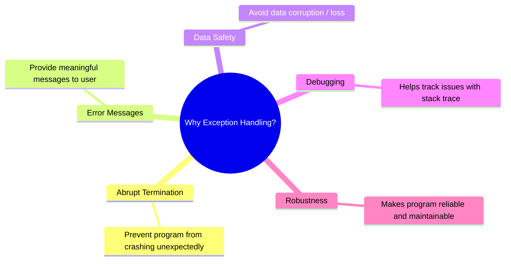
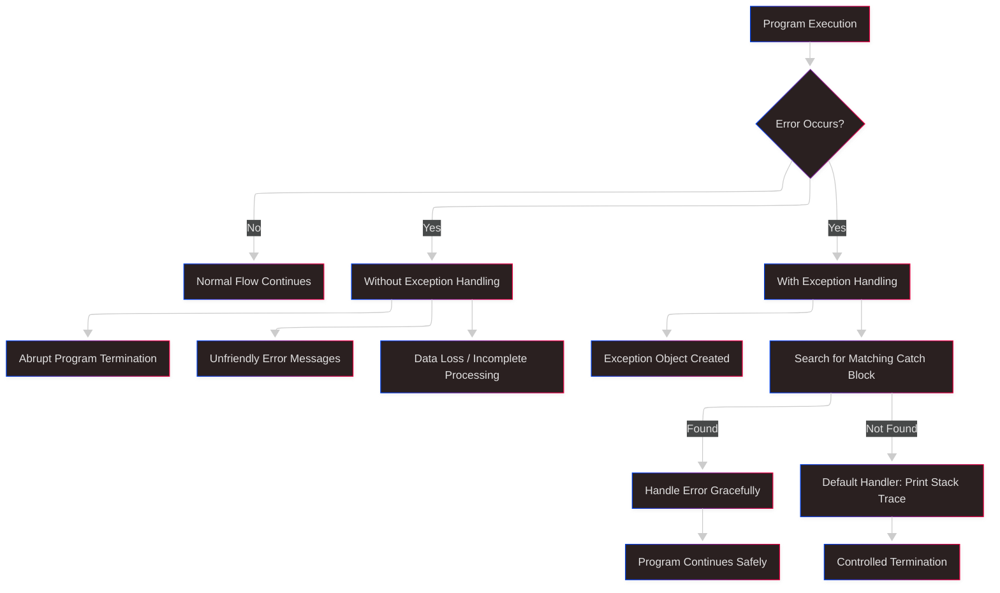
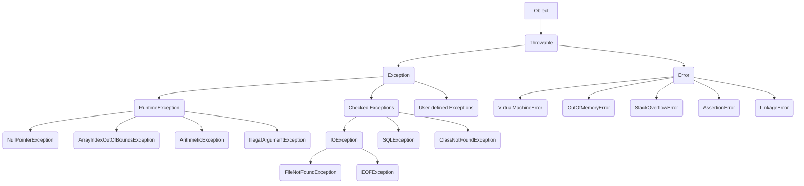
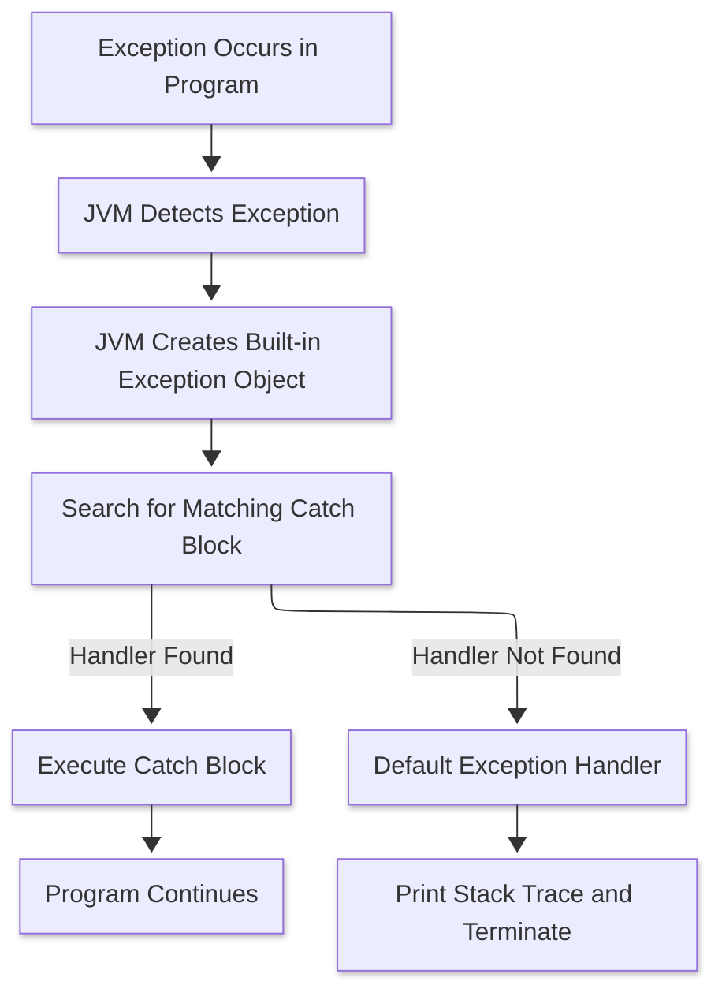
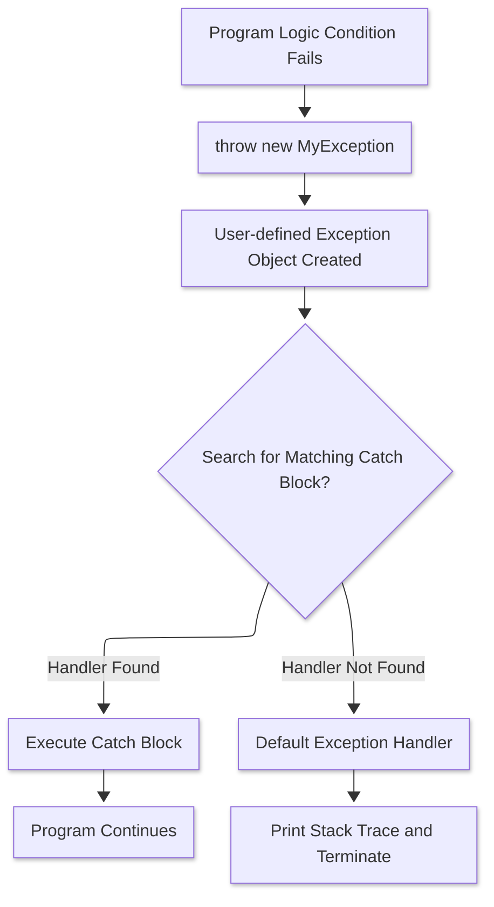
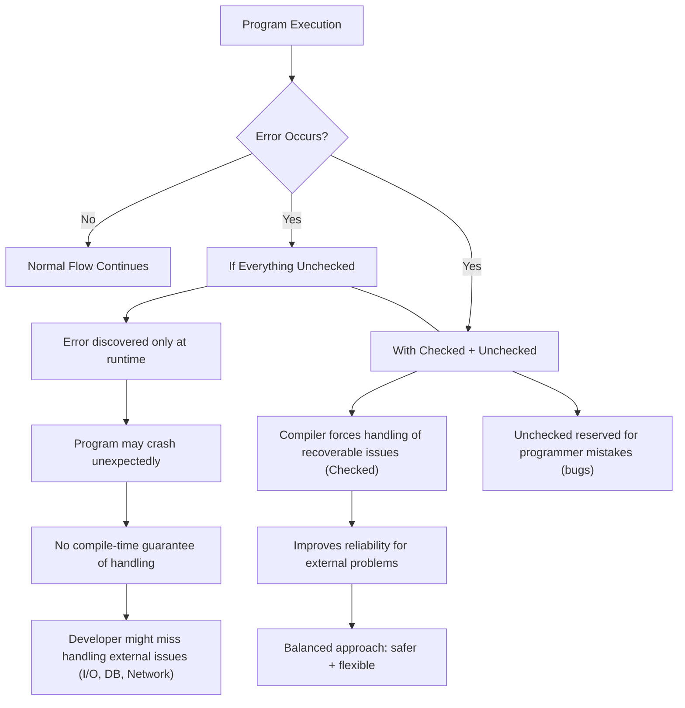

# Exception Handling

## What is an Exception ?
> In Java, an exception is an event occurs during the execution of program, disrupting its normal flow.
> When that happens the program will be terminated abruptly if not handled properly using Java's ``Exception Handling`` techniques.

### Reasons -
#### Programming errors (Unchecked exceptions)
1. [x] Invalid array access : Attempting to access an array element using an index outside the array's bounds. This leads to `ArrayIndexOutOfBoundsException`.
2. [x] Null reference access : Trying to access a method or field of an object whose reference is null. This causes a `NullPointerException`.
3. [x] Division by zero : Performing a division operation where the divisor is zero, resulting in an `ArithmeticException`.
4. [x] Invalid arguments to a method: Passing inappropriate or out-of-range values to a method, triggering an `IllegalArgumentException`.
5. [x] Type mismatch or illegal casts: Trying to cast an object to a class it's incompatible with, resulting in a `ClassCastException`.
6. [x] Class not found: Attempting to load a class that doesn't exist or is not available on the classpath, leading to `ClassNotFoundException`.
7. [x] Missing or non-existent methods/fields: Using reflection or class loading to access a method or field that is unavailable or non-existent in the target class, resulting in `NoSuchMethodException` or `NoSuchFieldException`.
8. [x] Incorrect API usage: Using an API incorrectly can cause various exceptions, depending on the API and the type of incorrect usage.

### Resource-related issues (Checked Exceptions)
1. [x] File Handling problems : Issues like trying to open a file that doesn't exist, reading past the end of a file, or insufficient permissions for file operations can cause IOException or its subclasses, such as `FileNotFoundException`.
2. [x] Network Connectivity Issues: Loss of network connection, server downtime, or firewall restrictions during network operations can trigger exceptions like `IOException` or `SocketException`.

## What is an Exception Handling ?
> - Exception Handling in Java is an effective mechanism for managing runtime & compile time errors to ensure the application's regular flow is maintained.
> - By handling exceptions, Java enables developers to create robust and fault-tolerant applications.

## Why do we need an Exception Handling ?


## Advantages of Exception Handling ?


## Difference between `Exception` & `Error`
| Aspect                | Exception                                                                 | Error                                                                 |
|------------------------|---------------------------------------------------------------------------|----------------------------------------------------------------------|
| Definition             | Represents conditions that a program can anticipate and handle gracefully | Represents serious issues that occur at runtime, mostly beyond the control of the program |
| Recoverability         | Usually recoverable with proper handling                                  | Generally not recoverable                                            |
| Handling Mechanism     | Can be caught and handled using `try-catch` blocks                        | Not recommended to catch; often leads to unstable program state      |
| Examples               | `IOException`, `SQLException`, `NullPointerException`, `ClassNotFoundException` | `OutOfMemoryError`, `StackOverflowError`, `VirtualMachineError`      |
| Origin                 | Mostly due to programming mistakes or external resource failures          | Mostly due to JVM limitations, hardware failure, or system crash     |
| Program Continuation   | Program can often continue after handling the exception                   | Program usually terminates abnormally                                |
| Part of                | `java.lang.Exception` class                                               | `java.lang.Error` class                                              |

```java
     Class ExceptionDemo {
            public static void main(String[] args) {
                int n = 10;
                int m = 0;
                
                int ans = n / m;
                // This line never gets executed as on the above line an exception has occurred.
                System.out.println("Result after divide by zero: " + ans);
            }
        }
        /**
         *    This throws ArithmeticException
        **/
```


```java
class ExceptionDemoByHandlingException {
    public static void main(String[] args) {
        int n = 10;
        int m = 0;
        
        try {
            // At below line, the exception occurs.
            int ans = n / m;
            // This never gets executed as the control goes to `catch` block to handle the exception
            System.out.println("Result after divide by zero: " + ans);
        } catch (ArithmeticException arithmeticException) {
            /*
                    Exception is handled here.
             */
            System.out.println("A number cannot be divided by zero. " +
                    "Exception occurred. Reason :" + arithmeticException);
        } finally {
            /*
                    finally block gets executed under any circumstances.
             */
            System.out.println("Program is continuing after handling the exception");
        }
    }
}
```


## Exception Hierarchy 


### Explanation -
- `Object` - The base class for all Java classes including exceptions & errors.
- `Throwable` - The root for the exception hierarchy and a direct subclass of `Object`. Any object representing an error or exceptional event must be a subclass of `Throwable`.
- `Exception` can be further categorized into 2 parts.
    - Checked Exception / Compile Time Exception
    - Unchecked Exception / `RuntimeException`
- `Error` - Represents severe problems, usually related to the `Java Virtual Machine (JVM)` or system resources, that are typically irrecoverable. Errors are not meant to be caught or handled
  by applications.

## How does JVM (Java Virtual Machine) handles an Exception ?

### Built-in Exception -


### User-defined Exception -

1. When an exception occurs, the JVM creates an `Exception` object (subclass of Throwable) containing the error name, description and program state.<br>
   - Error type / name : `NullPointerException` <br>
   - Description / Message : String passed to constructor or default one <br>
   - Program state / stack trace : Method calls, line numbers etc
2. Creating the exception object and handling it in the run-time system is called throwing an exception. <br>
   - Throwing = Creating an exception + handling it over to JVM's runtime system.
   - Example : `throw new ArithmeticException("/ by zero");` --> In case of built-in exception by itself as JVM knows about the exception. You don't have to do anything. <br>
               `throw new MyException("This is a custom exception");` --> you throw it to JVM.
3. There might be a list of the methods that had been called to get to the method where an exception occurred. This ordered list of methods is called `call stack`.
   - call stack = chain of method calls.
   - Example : `main() |- methodA() |- methodB() |- methodC() ` (Exception in methodC())
   - JVM stores this in the stack trace.
4. The run-time system searches the call stack for an exception handler
   - JVM uses the exception table (built at compile time from `try/catch`) to know where the handlers are.
5. It starts searching from the method where the exception occurred and proceeds backward through the call stack.
   - This is called `stack unwinding`
   - JVM first looks in the current method; if not found, pops method, goes to caller, repeats.
6. If a handler is found, the exception is passed to it.
   - If a matching `catch` is found, JVM transfers control there.
7. If no handler is found, the default exception handler terminates the program and prints the stack trace.
   - Default Handler = part of JVM runtime
   - Behaviour : `Print stack trace -> Terminate thread/program`
   - In main thread: JVM ends program. In other threads: that thread dies, rest continue
      
## Important points to note :

##### **POINT - 1**
- When JVM handles built-in exceptions :
  - If your code causes something like 10/0 -> JVM automatically creates an `ArithmeticException` object.
  - You don't explicitly create or throw it -> JVM does it for you.
- When you use a custom or user-defined exception
  - You must explicitly create and throw the object - JVM will not do it for you.
  - JVM won't automatically throw your custom class, because it does not know your conditions.
- What if you don't use `throw` for user-defined exceptions
  - If you just write a try-catch block with your custom exception class but never throw it, it will never be triggered. 
  - The catch block will remain unused. 
  - So for user-defined exceptions, you either:
    - Explicitly throw them where needed, OR
    - Use them in method signatures (throws MyException) and throw them later.

##### **POINT - 2**
- when you are using a custom OR user-defined exception
   - Define a user-defined exception class by extending `Exception` class
   - Either inside the same function, you both `throw` and `catch` that exception. OR `throw` at the lower-level method and `catch` it in a higher-level i.e. called of the method.
   ```java
   class MyException extends Exception {
        public MyException(String message) {
            super(message);
        }
   }
  
   public class Test {
        public static void main(String[] args) {
            new Test().process();
        }
        void process() {
            try {
                // Some condition fails
                if (true) {
                    throw new MyException("Custom check failed!");
                }
                System.out.println("Normal execution...");
             } catch (MyException e) {
                System.out.println("caught inside same method: " + e.getMessage());
             }
             System.out.println("After catch block, program continues...");
        }
  }
  ```
- What if you don't write the `catch` at all
   - JVM creates your custom Exception class object and starts searching for a matching catch in the same method.
      - If no catch exists in that method.
         - The JVM looks at the caller method in the call stack.
         - If the caller also does not handle it, the exception keeps bubbling up the stack.
      - if no method in the stack handles it:
         - The JVM finally hands it over to the default exception handler.
         - The default handler:
            - prints the stack trace (Showing error name, message, and call chain)
            - terminates the program
   - For `Checked Exceptions` (like your MyException if it extends `Exception`), then compiler forces you to either:
        - Handle with try-catch, or
        - Declare with `throws` keyword in the method signature
   - For `Unchecked Exceptions` (If your MyException extends `RuntimeException`), you don't need `throws`, but the bubbling and default handler behaviour is the same.
  
   ```java
   class MyException extends Exception {
        public MyException(String message) {
            super(message);
        }
   }
   class class Test {
        public static void main(String[] args) {
            new Test().process();
            System.out.println("This line will NOT execute if exception is not caught");
        }
        void process() throws MyException { // throws because MyException is considered to be a Checked Exception
            // No try-catch here
            throw new MyException("Something went wrong");
        }
   }
  ```
  

## Checked vs UnChecked Exceptions :
- **Checked Exceptions** : These exceptions are checked at compile time, forcing the programmer to handle them explicitly.
- **Unchecked Exceptions** : These exceptions are checked at runtime and do not require handling at compile time. 

### Checked Exceptions 
- These are the exceptions that are checked at compile time.
- If a method throws checked exception, then the exception must be handled using a `try-catch` block and declared the exception in the method signature
  using the `throws` keyword.
- Checked exceptions represent invalid conditions in areas outside the immediate control of the program like memory, network, file system etc.
- Any checked exception is a subclass of `Exception`.
- Unlike Unchecked exceptions, checked exceptions must be either caught by the caller or listed as part of the method signature using the `throws` keyword.
- Checked exceptions can be categorized into 2 parts.
    - Fully Checked Exception 
    - Partially Checked Exception

### Unchecked Exceptions


## Important points to note :
### POINT - 1
### Why JAVA introduced `Checked Exceptions` ? Why cannot everything be put inside `Unchecked Exceptions` ?

- Forcing developers to handle critical failures (Checked Exceptions)
   - Some failures cannot be ignored safely (e.g., IOException, SQLException).
   - If everything were runtime exceptions, a careless developer might just skip handling them → leading to data loss, corrupted files, or security issues.
   - By making them checked, Java forces you to acknowledge and handle them either by:
       - Catching with try-catch, OR
       - Declaring with throws in method signature.

```java
import java.io.FileReader;

FileReader fr = new FileReader("abc.txt"); // FileNotFoundException must be handled
```
- Separating developer errors vs external failures
  - Unchecked exceptions (Runtime) → represent programming mistakes that are not expected to be recovered from.
      - Examples: `NullPointerException`, `ArrayIndexOutOfBoundsException`, `IllegalArgumentException`.
      - They indicate bugs in the code logic → should be fixed in development, not handled at runtime.
  - Checked exceptions → represent external problems (files, DB, network, resources) that the program can anticipate and recover from.
- Encouraging robust & reliable programs
  - Checked exceptions were meant to make enterprise applications safer.
  - Especially in the 90's, when Java was designed for large-scale business apps, robust error handling was critical.
- Why not make everything runtime ?
  - If everything were unchecked:
      - Developers might forget to handle critical issues (file not found, DB connection failure)
      - Code would compile fine, but would blow up at runtime unexpectedly.
      - larger systems would become unreliable.

### Code analysis -
1. **Checked Exception (Compile-time) example**
```java
import java.io.BufferedReader;
import java.io.FileReader;
import java.io.IOException;

public class CheckedExample {
    public static void main(String[] args) {
        try {
            // Trying to open a file that may or may not exist
            FileReader f = new FileReader("abc.txt");
            BufferedReader b = new BufferedReader(f);
            System.out.println(b.readLine());
        } catch (IOException e) {
            System.out.println("Error: " + e.getMessage());
        }
    }
}
```
- `FileReader` constructor can throw `FileNotFoundException` (a checked exception).
- The compiler forces you to wrap in `try-catch` or declare `throws IOException` in the method.
- Why ? Because missing files, permission issues, disk errors --> are external problems you must plan for.

2. **Unchecked Exception (Runtime) example**
```java
public class UncheckedExample {
    public static void main(String[] args) {
        int[] arr = {10, 20, 30};
        
        // Accessing out of bounds index
        System.out.println(arr[5]);  // Runtime error: ArrayIndexOutOfBoundsException
    }
}
```
- This is a programmer mistake (bad index)
- Compiler does not ask you to handle it, because the right solution is to fix the bug -> not to surround every array access with `try-catch` block.

3. **What if all were `Runtime` exceptions ?**
```java
import java.io.*;

public class AllUncheckedExample {
    public static void main(String[] args) throws Exception {
        // If IOException was unchecked, compiler wouldn't complain
        FileReader fr = new FileReader("abc.txt");
        BufferedReader br = new BufferedReader(fr);
        System.out.println(br.readLine());
    }
}
```
📌 Problem:
- Program compiles fine even if we don't handle missing file.
- At runtime -> if file is absent -> app crashes unexpectedly.
- In a banking or medical system, this would be dangerous.
That's why Java designers made I/O, DB, network etc Checked exceptions -> You must consciously handle them.

